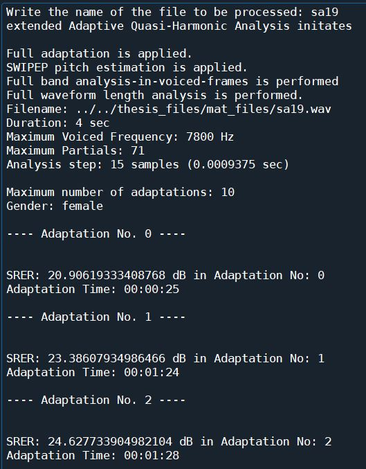
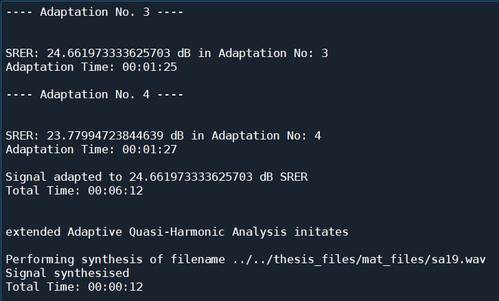
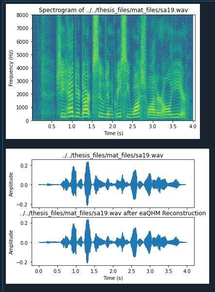

# extended adaptive Quasi-Harmonic Analysis and Synthesis of Speech in Python

###### Author: Panagiotis Antivasis, Undergraduate Student at [Computer Science Department - University of Crete](https://www.csd.uoc.gr/)

### Introduction
The following repository is the source code corresponding to the thesis of **Panagiotis Antivasis**, an undergraduate **Computer Science** student in **[University of Crete](https://www.uoc.gr/)**. 

This code is built upon a speech analysis and synthesis system named [ROBUST FULL-BAND ADAPTIVE SINUSOIDAL ANALYSIS AND SYNTHESIS OF SPEECH, by George P. Kafentzis, Olivier Rosec, Yannis Stylianou](https://www.csd.uoc.gr/~kafentz/Publications/Kafentzis%20G.P.,%20Rosec%20O.,%20and%20Stylianou%20Y.%20Robut%20Adaptive%20Sinusoidal%20Analysis%20and%20Synthesis%20of%20Speech.pdf). The system in the so-called **Extended Adaptive Quasi-Harmonic Model (eaQHM)** and this source code implements it into **Python** (specifically **Python 3.8.3**). The implemented functions should produce the right output in the shortest amount of time possible, a challenging process due to the nature of **Python** language. The code consists mainly of functions that perform speech analysis, synthesis and interpolation and those of utmost significance are **eaQHManalysis**, **eaQHMsynthesis** and all the other functions they call (**iqhmLS_complexamps**, **aqhmLS_complexamps**, **eaqhmLS_complexamps**, **phase_interp**). It also contains a number of functions for doing simple operations such as array transposition, parameter file loading and array indexing and some functions that can be used for debugging like comparing two items, print a prompt if a condition is true, viewing the differences of two arrays etc.

### eaQHManalysis
**eaQHManalysis** is a function that performs **Extended Adaptive Quasi-Harmonic Analysis** in a signal using the **extended adaptive Quasi-Harmonic Model** and decomposes speech into AM-FM components according to that model. In other words, it receives a parameter file or [dictionary](https://www.w3schools.com/python/python_dictionaries.asp) that includes all necessary data of the signal and produces a [Deterministic](https://citeseerx.ist.psu.edu/viewdoc/download?doi=10.1.1.16.5702&rep=rep1&type=pdf) and optionally, a [Stochastic](https://citeseerx.ist.psu.edu/viewdoc/download?doi=10.1.1.16.5702&rep=rep1&type=pdf) component of the signal by assuming an initially harmonic model by applying an ```f0``` estimation and then iteratively refining it, until the reconstructed signal converges in **quasi-harmonicity**. This model is time and memory consuming, but provides higher quality and flexibility in resynthesizing speech compared to the classic models, such as the **[adaptive Harmonic Model (aHM)](https://www.researchgate.net/publication/233397684_A_Full-Band_Adaptive_Harmonic_Representation_of_Speech)**, and the **[classic Sinusoidal Model (SM)](https://archive.ll.mit.edu/publications/journal/pdf/vol01_no2/1.2.3.speechprocessing.pdf)**.

**eaQHManalysis** employs several functions, either library or implemented functions and creates certain classes that mostly describe the function's return values. The code comments include more information about each function/class and its components.

##### Arguments
* **```speechFile: string```** - The location of the mono wav file to be analysed, and determines the values of ```s```, ```fs```, ```len``` and ```deterministic_part```.
* **```paramFile: string```** - The location of a parameter file containing all necessary parameters for the function. The file must contain the following parameters:
    * **```gender: string```** - The gender of the speaker.
    * **```step: int```** - The step size of the analysis in samples. *Default value: ```15```*.
    * **```opt: array```** - An array with 11 integers, each one mapped to a respective option parameter:
        * ```opt[0]: fullWaveform, int (flag)``` - Full waveform length analysis.
        * ```opt[1]: <don't care>```
        * ```opt[2]: fullBand, int (flag)``` - Full band analysis-in-voiced-frames flag.
        * ```opt[3]: extended_aQHM, int (flag)``` - Extended aQHM.
        * ```opt[4]: <don't care>```
        * ```opt[5]: <don't care>```
        * ```opt[6]: highPassFilter: int (flag)``` - High pass filtering at 30 Hz (preprocess).
        * ```opt[7]: <don't care>```
        * ```opt[8]: SWIPEP, int (flag)``` - SWIPEP pitch estimator.
        * ```opt[9]: <don't care>```
        * ```opt[10]: numPartials, int``` - The number of partials.
    * **```adpt: int``` *(optional)*** - The maximum number of adaptations allowed. *Default value: ```6```*
    * **```NoP: int``` *(optional)*** -  The number of analysis window size, in pitch periods. *Default value: ```3```*
    * **```opt_pitch_f0min: float```** - The minimum amount of optimal estimated frequency ```f0```.
    * **```f0sin: array```** - The ```f0``` estimates for every time instant along with the time instants and their strength. If ```opt[8] == 1```, this parameter is ignored. If not contained, a SWIPEP pitch estimation is applied.
    * **```PAW: int```** - The sample of the pitch analysis window, where the analysis starts. *Default value:```32```*
* **```printPrompts: bool``` *(optional)*** - Determines if prompts of this process will be printed. *Default value: ```True```*
* **```loadingScreen: bool``` *(optional)*** - Determines if a **tqdm** loading screen will be displayed in the console. *Default value: ```True```*
        
##### Returns
* **```D: array```** - The Deterministic part of the signal. An array containing elements of ```Deterministic``` type.
* **```S: array```** - The Stochastic part of the signal. An array containing elements of ```Stochastic``` type. If ```fullWaveform == 1```, an empty array is returned.
* **```V: Various```** - Various important data. An object of ```Various``` type.
* **```SRER: array```** - An array containing all the SRER (Signal-to-Reconstruction-Error Ratio) of each adaptation of the signal.
* **```aSNR: array```** - An array containing each SNR (Signal to Noise Ratio) of each time instant per adaptation of the signal.

##### Process
**eaQHManalysis** begins by printing some prompts and loading some basic variables. Then it proceeds by creating the **Deterministic** and then, if ```options[fullWaveform] != True``` the **Stochastic** part of the signal. The last part however is not tested yet, so it will not be furtherly explained:

###### Deterministic Part

The signal is split in time instants (```ti```), based on the ```step``` variable. It is then iterated ```adpt + 1``` times for each time instant from ```PAW*step``` to ```len - PAW*step```. Then, for each 2 consecutive voiced frames, whose info can be extracted from ```P```, the **analysis part** of the current frame is initiated:

* In adaptation 0, a **full-band harmonicity** is assumed and the frame is multiplied with a Blackman Window via **iqhmLS_complexamps** function in an estimated frequency spectrum (```fk```), thus obtaining the complex amplitudes (```ak```) and slopes (```bk```) via [Least Squares](https://www.youtube.com/watch?v=P8hT5nDai6A). No f0 correction mechanism is required now, as we assume an initially harmonic model.

* In adaptation 1 and after, the **FM** and **AM** components (```fm_tmp``` and ```am_tmp``` respectively) of the frame are created. This happens by initially extracting all non-zero frequency values of the frame and the corresponding amplitudes, generating the components said previously containing those values in the appropriate positions, while the rest being zero. Those components are not ready for use yet, as they contain many zero frequency trajectories and amplitudes, so the process must now solve these issues by either **"giving birth to"** or **"killing"** frequency trajectories and amplitudes from those components. This can be explained more fluently: A new frequency is **"born"** if there is at least one zero value in the first position of the component and if so, it is replaced with the first non-zero one, for the k-frequency. A frequency is **"killed"** if there is at least one zero value in the last position of the component and if so, it is replaced with the last non-zero one, as done previously. Finally, all those components are linearly interpolated to be extended. This is repeated as many times as the number of non-zero frequencies is (```Kend```). After this process ends, the frame is once again multiplied with a [Hamming Window](https://www.sciencedirect.com/topics/engineering/hamming-window) via either **aqhmLS_complexamps** if ```extended_aQHM == 0``` or **eaqhmLS_complexamps** otherwise, using the **FM** and/or **AM** components created, and thus once again obtaining the complex amplitudes (```ak```) and slopes (```bk```) via [Least Squares](https://www.youtube.com/watch?v=P8hT5nDai6A). At the end, the correction mechanism (```df_tmp```) is introduced using those amplitudes and slopes.

After either of those cases, the values of instantaneous amplitudes (```am_hat```) and phases (```pm_hat```) for each frequency index are estimated via ```ak``` and the angle of ```ak``` respectively, while the instantaneous frequencies (```fm_hat```) are estimated either by ```k*f0``` for k-th frequency in adaptation 0 or by selectively correcting the current frequency by the correction mechanism (```df```), depending on if the estimated frequency exceeds ```opt_pitch_f0min``` or not.

Next, the **interpolation part** takes place, where all instantaneous structures created previously are interpolated over the time instants for each sinusoid, only to the non-zero values of **AM** components whose indices have time difference:
* The instantaneous amplitudes (```am_hat```) are linearly interpolated.
* The instantaneous frequencies (```fm_hat```) are interpolated in 3rd order interpolation
* The instantaneous phases (```pm_hat```) are interpolated via **phase_interp** using the **"integr"** method.
* As a final step, frequency tracks (```fm_cur```) are generated by unwrapped phases

The reconstructed signal (```s_hat```) can now be obtained by taking the interpolated amplitude of the mean value of each window's center (```a0_hat```) and using the instantaneous amplitudes (```am_hat```) and phases (```pm_hat```) to generate a sum of sinusoids, which is then added to the interpolated mean values. Finally, **Signal-to-Reconstruction-Error Ratio** (```SRER```) of the current adaptation is calculated. If a ```SRER``` is less than some threshold depending on the SRER of the previous adaptation, this means the reconstruction of the signal has adapted and no further adaptation is required. Thus, the iteration terminates, all necessary data are stored in the corresponding structures and we can proceed to the next step.
 
### eaQHMsynthesis
**eaQHMsynthesis** does the exact opposite of **eaQHManalysis**, meaning it receives the output of the latter and performs **extended Adaptive Quasi-Harmonic Synthesis** in a signal using the **extended Adaptive Quasi-Harmonic Model**. In other words, it extracts ```D```, ```S``` and ```V``` returned parameters from **eaQHManalysis** and resynthesizes the signal according to those parameters. 

Unlike **eaQHManalysis**, **eaQHMsynthesis** barely reaches 100-130 lines of code and it does not use implemented functions, therefore is way faster.

##### Arguments
* **```D: array```** - The Deterministic part of the signal. An array containing elements of ```Deterministic``` type.
* **```S: array```** - The Stochastic part of the signal. An array containing elements of ```Stochastic``` type.
* **```V: Various```** - Various important data. An object of ```Various``` type.
* **```printPrompts: bool``` *(optional)*** - Determines if prompts of this process will be printed. *Default value: ```True```*
* **```loadingScreen: bool``` *(optional)*** - Determines if a **tqdm** loading screen will be displayed in the console. *Default value: ```True```*
        
##### Returns
* **```s: array```** - The reconstructed speech signal
* **```qh: array```** -  The reconstructed deterministic part (quasi-harmonic)
* **```noi: array```** - The reconstructed stochastic part. If ```len(S) == 0```, an empty array is returned.

##### Process
**eaQHMsynthesis** begins just like **eaQHManalysis** by printing some prompts and loading some basic variables. Then it proceeds by applying interpolation to all instantaneous structures the same way as the **interpolation part** of **eaQHManalysis**. While each component is interpolated, a normal synthesis is applied and stored in the **quasi-harmonic deterministic part** of the signal (```qh_or or qh```).

After this process ends the **deterministic part** (```qh```) is combined with the **stochastic part** (```noi```) to resynthesize the final signal (```s```).

### How to Run
1. Unzip "**parameter_and_wav_files.zip**" in the location of your choice.
2. Open **main.py** in either [Spyder](https://www.spyder-ide.org/) or any other Python environment.
3. Make sure to do a ```pip install -r requirements.txt``` first.
4. In line ```28```, change ```root``` variable to the path of the unzipped "**parameter_and_wav_files.zip**" folder.
5. Run the code.
6. Write the plain name (no path or *.wav*) of the file to be processed in the console and press ***Enter***.
7. After some prompts and plots are printed, a "***filename*_reconstructed.wav** file will be generated in the ```root``` path.

Here is an example of the output of the code running the "SA19" parameter file in [Spyder](https://www.spyder-ide.org/):





##### Notes
* A basic display may be viewed by setting ```loadingScreen=True```, which will enable a **tqdm** loading bar in the console (may require ```'pip install tqdm'```).
* This code requires at least **Python 3.8.3** version or newer.
* At the time of publication, certain sections of the code have not been tested. Those parts that are inaccessible based on the majority of the parameters given are marked with the phrase ```#----NOT TESTED----```. If changes are made in those parameters, that does not guarantee these sections will work properly.

### Pros
* **Python** is a simple and easy-to-read language. This makes the code legible and easy to comprehend, even for those unfamiliar with the project's subject. 

* Many variables may change types during the procedure, as well as many functions may return different types of arguments depending on the input. The fact that **Python** is a dynamically-typed language, completely solves these issues.

* **Python** is a free and open-source software, with its modules also being free. As a result, this code can be executed by everyone. 

### Cons
* As previously indicated, this code is extremely large and complex, and its time complexity is determined not only by the size of the signal (```len```), but also by the maximum number of sinusoids employed in it (```Kmax```). The majority of the lines are additional functions implemented, some **Python** library functions, and they are all in loops with their own nested loops. In comparison, a three second speech file takes at least 4:20 minutes to process.

* **Python** already occupies a lot of memory by itself. For example, the files tested were sampled in ```fs = 16000 Hz```, which is a small sampling frequency, yet a significant memory drain was observed. 

### Conclusion
In conclusion, **Extended Adaptive Quasi-Harmonic Analysis** and **Synthesis** were implemented into **Python**. The process returns the valid results, is easy to read and understand and is widely available. On the other hand, it is time consuming and memory dependent. Until this day, time and memory consumption is still an issue with **Python**. Perhaps a faster and less memory-consuming language, such as **Java** or **C++** could be used to counter this setback. Nevertheless, this code can help everyone understand **Extended Adaptive Quasi-Harmonic Model (eaQHM)**, even those who are not familiar with it.