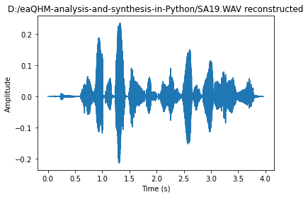

# AM-FM decomposition of Speech using the extended adaptive Quasi-Harmonic Model

### Author: Panagiotis Antivasis, Nov. 2021

## Introduction
This code is built upon a speech analysis and synthesis system from paper [[1]](#Reference). The system is the so-called **extended adaptive Quasi-Harmonic Model (eaQHM)** and this is the Python source code implementation.

## eaQHMAnalysisAndSynthesis
**eaQHMAnalysisAndSynthesis** is a function that performs **extended adaptive Quasi-Harmonic Analysis and Synthesis** of a speech signal. In other words, it receives a *.wav* file and some other optional parameters and decomposes speech into AM-FM components according to the model mentioned, by producing a [Deterministic component](https://citeseerx.ist.psu.edu/viewdoc/download?doi=10.1.1.16.5702&rep=rep1&type=pdf) of the signal and then iteratively refining it, until the reconstructed signal converges in *quasi-harmonicity* [[1]](#Reference). 

## Prerequisites & Requirements
**Python 3.8.x** and up. It is also highly suggested to use [Spyder](https://www.spyder-ide.org/) environment as the whole code was tested in it. Before you run the code, make sure to install all requirements by executing:
```Python
pip install -r requirements.txt
```

## How to Run
A *main.py* file is provided, which executes **eaQHMAnalysisAndSynthesis** on a speech signal, whose name is given as an input on the console. The gender of the speaker may also be specified. A sample from a female speaker, named *SA19.wav* is also included, but you can use any mono *.wav* file you want.

What you have to do is:
1. Open *main.py*.
2. Run the code.
3. Write the name of the *.wav* file to be processed in the console.
4. Specify the gender of the speaker ("male", "female" or other). You may also use "child" as an input.
5. The program will print some prompts showing the **Signal-to-Reconstruction-Ratio (SRER)** [[1]](#Reference) of each adaptation and some plots will be generated.
6. After the program terminates, a *\*filename\*_reconstructed.wav* file will be generated.

Here is an example of the output of the code running *SA19.wav*:


And here are the plots produced:




## Code citation
If you wish to use this code, please cite it using the following:
* Panagiotis Antivasis, eaQHM analysis and synthesis system, (2021), GitHub repository, https://github.com/Antibas/eaQHM-analysis-and-synthesis-in-Python

If you wish to cite the main paper on which this code has been developed, please use the following:
* G. P. Kafentzis, O. Rosec and Y. Stylianou, "Robust full-band adaptive Sinusoidal analysis and synthesis of speech," 2014 IEEE International Conference on Acoustics, Speech and Signal Processing (ICASSP), 2014, pp. 6260-6264, doi: 10.1109/ICASSP.2014.6854808.

## Reference
1. [ROBUST FULL-BAND ADAPTIVE SINUSOIDAL ANALYSIS AND SYNTHESIS OF SPEECH, by George P. Kafentzis, Olivier Rosec, Yannis Stylianou](https://www.csd.uoc.gr/~kafentz/Publications/Kafentzis%20G.P.,%20Rosec%20O.,%20and%20Stylianou%20Y.%20Robut%20Adaptive%20Sinusoidal%20Analysis%20and%20Synthesis%20of%20Speech.pdf)
