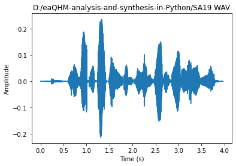

# extended adaptive Quasi-Harmonic Analysis and Synthesis of Speech in Python

### Author: Panagiotis Antivasis, Undergraduate Student at [Computer Science Department - University of Crete](https://www.csd.uoc.gr/)

## Introduction
The following repository is the source code corresponding to the thesis of **Panagiotis Antivasis**, an undergraduate [Computer Science](https://www.csd.uoc.gr/) student in [University of Crete](https://www.uoc.gr/). 

This code is built upon a speech analysis and synthesis system named [ROBUST FULL-BAND ADAPTIVE SINUSOIDAL ANALYSIS AND SYNTHESIS OF SPEECH, by George P. Kafentzis, Olivier Rosec, Yannis Stylianou](https://www.csd.uoc.gr/~kafentz/Publications/Kafentzis%20G.P.,%20Rosec%20O.,%20and%20Stylianou%20Y.%20Robut%20Adaptive%20Sinusoidal%20Analysis%20and%20Synthesis%20of%20Speech.pdf). The system in the so-called **Extended Adaptive Quasi-Harmonic Model (eaQHM)** and this source code implements it into **Python**. The code consists mainly of functions that perform speech analysis, synthesis and interpolation and those of utmost significance are **eaQHManalysis** and **eaQHMsynthesis**.

## eaQHManalysis
**eaQHManalysis** is a function that performs **Extended Adaptive Quasi-Harmonic Analysis** in a signal using the **extended adaptive Quasi-Harmonic Model** and decomposes speech into AM-FM components according to that model. In other words, it receives a parameter file that includes all necessary data of the signal and produces a [Deterministic](https://citeseerx.ist.psu.edu/viewdoc/download?doi=10.1.1.16.5702&rep=rep1&type=pdf) component of the signal by assuming an initially harmonic model by applying an ```f0``` estimation and then iteratively refining it, until the reconstructed signal converges in *quasi-harmonicity*. This model is time and memory consuming, but provides higher quality and flexibility in resynthesizing speech compared to the classic models, such as the [adaptive Harmonic Model (aHM)](https://www.researchgate.net/publication/233397684_A_Full-Band_Adaptive_Harmonic_Representation_of_Speech), and the [classic Sinusoidal Model (SM)](https://archive.ll.mit.edu/publications/journal/pdf/vol01_no2/1.2.3.speechprocessing.pdf).
 
## eaQHMsynthesis
**eaQHMsynthesis** does the exact opposite of **eaQHManalysis**, meaning it receives the output of the latter and performs **extended Adaptive Quasi-Harmonic Synthesis** in a signal using the **extended Adaptive Quasi-Harmonic Model**. In other words, it extracts ```D```, ```S``` and ```V``` returned parameters from **eaQHManalysis** and resynthesizes the signal according to those parameters.

## Release Notes
### Version 1.0

#### Features
* **Phase adaptation (aQHM)** or **Full adaptation (eaQHM)** is supported.
* Preprocessing high pass filter may be applied.
* [SWIPEP pitch estimator](ADDLINK) is provided. 
* Full-band analysis.
* Either full waveform or only voiced parts are analyzed.
* Plots are viewed showing the signal in time domain before and after reconstruction, as well as the signal's pitch estimations.
* A basic loading screen may be viewed by setting 
```Python
loadingScreen=True
```
as a parameter in the functions, which will enable a [tqdm](https://tqdm.github.io/) loading bar in the console.

## How to Run
A *main.py* file is provided, which executes **eaQHManalysis** on a speech signal, whose name is given as an input on the console and **eaQHMsynthesis** to the output of the former. For the program to run, a database of *.wav* and parameter files are included in "*parameter_and_wav_files.zip*".

What you have to do is:
1. Unzip "*parameter_and_wav_files.zip*" in the location of your choice.
2. Open *main.py*.
3. In line ```28```, change ```root``` variable to the path of the unzipped "*parameter_and_wav_files.zip*" folder.
4. Run the code.
5. Give as input the plain name (no path or *.wav*) of the file to be processed in the console.
6. After the program terminates, a "*\*filename\*_reconstructed.wav*" file will be generated in the ```root``` path.

Here is an example of the output of the code running the "SA19.wav" file in [Spyder](https://www.spyder-ide.org/):


And here are the plots produced:




## Prerequisites & Requirements
**Python 3.8.3** and up. It is also highly suggested to use [Spyder](https://www.spyder-ide.org/) environment as the whole code was tested in it. Before you run, make sure to install all requirements by executing:
```Python
pip install -r requirements.txt
```

## Known Issues
* This code takes a lot of time, due to the nature of **Python** language, even for small speech files.
* The results may be different than expected if [SWIPEP pitch estimator](ADDLINK) is used instead of extracting the pitch estimations from the parameter files.
* At the time of publication, certain sections of the code have not been tested. Those parts that are inaccessible based on the majority of the parameters given are marked with the phrase:
```Python
#----NOT TESTED----
```
If changes are made in those parameters, that does not guarantee these sections will work properly.